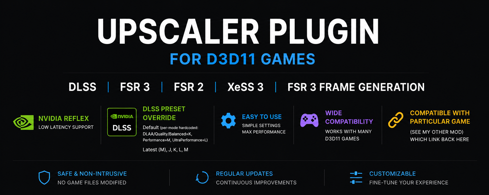

# GamePlug Upscaler for DirectX 11/12

Universal upscaler powered by **GamePlug** featuring FSR1, FSR2, FSR3, DLSS, DLAA, and XeSS with FSR3 frame generation support. Improves image quality and performance scaling in DirectX 11 games. Simply place `upscaler_plugin.dll` and `dinput8.dll` or `version.dll` in the game executable folder to use.

GamePlug Upscaler brings modern upscaling support to x64 & x32 DirectX 11 games using the GamePlug framework. The current version implements FSR1, FSR2, FSR3, DLSS, DLAA, XeSS with FSR3 frame generation for sharper image quality and improved performance scaling in older D3D11 titles.

---

## Features

- **Universal DirectX 11 upscaler**
- **x64 Upscaling Support:** FSR1, FSR2, FSR3, DLSS, DLAA, XeSS with FSR3 frame generation implementation
- **x32 Upscaling Support:** FSR1 implementation
- **Plugin-based architecture** powered by GamePlug Labs
- **Lightweight DLL-based injection**
- **Designed for compatibility** with older PC games

---

## Downloads

*Optional: Download files required for your desired upscaling type.*

- **FSR2 v2.2.1 files**: [FidelityFX-FSR2-DX11 Releases](https://github.com/gameplug-labs/FidelityFX-FSR2-DX11/releases/tag/v2.2.1)
- **FSR3 v3.1.2 files**: [FidelityFX-SDK Releases](https://github.com/gameplug-labs/FidelityFX-SDK/releases/tag/fsr3-v3.1.2)
- **DLSS files**: [Streamline Releases](https://github.com/NVIDIA-RTX/Streamline/releases/tag/v2.11.1)
- **XeSS3 files**: [XeSS Releases](https://github.com/intel/xess/releases/tag/v3.0.1)

---

## Installation

1. **Extract the downloaded files.**
2. **Place the following files** into the same folder as the game executable (`.exe`):
   - `upscaler_plugin.dll`
   - `upscaler_plugin.conf`
   - **Plus the files for your chosen upscaler:**
     - **For FSR2:**
       - `ffx_fsr2_api_x64.dll`
       - `ffx_fsr2_api_dx11_x64.dll`
     - **For FSR3 Frame Generation:**
       - `ffx_frameinterpolation_x64.dll`
       - `ffx_opticalflow_x64.dll`
     - **For FSR3 Upscaling:**
       - `ffx_fsr3upscaler_x64.dll`
       - `ffx_backend_dx11_x64.dll`
     - **For DLSS:**
       - `sl.interposer.dll`
       - `sl.dlss.dll`
       - `sl.common.dll`
       - `nvngx_dlss.dll`
       - `sl.reflex.dll`
       - `sl.pcl.dll`
     - **For XeSS:**
       - `libxess.dll`
       - `libxess_dx11.dll` *(Optional - required for Intel Arc GPU only)*
     - **Injector DLL:**
       - `dinput8.dll` or `version.dll` *(depends on the game; acts as the injector linking back to this upscaler)*
3. **Launch the game.**

---

## Framework

Powered by [GamePlug](https://github.com/gameplug-labs).

Join the [GamePlug Discord](https://discord.gg/TyyDD3C7wQ) for announcements, news, and new features!
